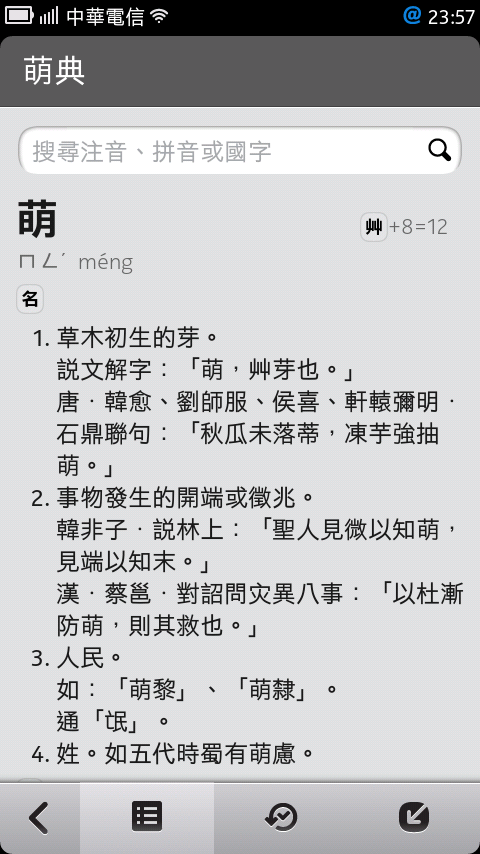

moedict-meego
=============
A MeeGo Harmattan client port for [g0v.tw](http://dev.g0v.tw) moedict project.

Getting Started
---------------
### Dependencies
* **Perl 5.14+** - required by [moedict-epub](https://github.com/g0v/moedict-epub)
* **Python 2.7+** - for building index (tested under 2.7.4)
* [Qt SDK](http://www.developer.nokia.com/Develop/Qt/Tools/) from Nokia - for N9 toolchain

### Building index
```
rschiang@RSChiang:~/moedict-meego$ make index
```
During the first run, `make source` is invoked. The build system will automatically fetch required 
repositories and generate mapped UTF-8 source file, which you can manually update by typing 
`make update source`.

The generated files are located at `data` folder, among with description files.
- `manifest.json` declares information related to dictionary index version.
- `index.json` is a compact JSON dict with Title - Raw Entry mapping.
- `lookuptable.json` consists of extracted lookup information for use with incremental search.

Getting Involved
----------------
### Releases
- v13.6.7 - Initial, with progressive search usable
- v13.6.22 - Enable selection, copy link, and tested across different PR version

### Milestones
- ~~Basic UI~~ (done)
- ~~Build and include offline index~~ (done)
- ~~Update functionality~~ (done)
  Client itself doesn't include dictionary files 
  and thus require a download ("update") during OOBE.
- ~~Progressive search~~ (done)
- Integrate online API

### To-dos
You can freely pick up and send us a PR! :)
- Improve search efficiency
- Able to show pronouncation in History page
- Incremental updater
- "Search on Web" and "Share to" feature

Join #g0v.tw discussion on Plurk or freenode IRC.

Screenshots
-----------

